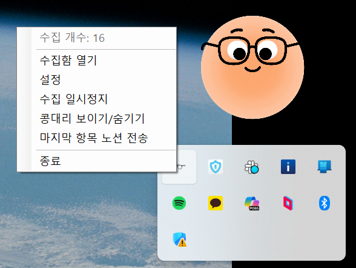
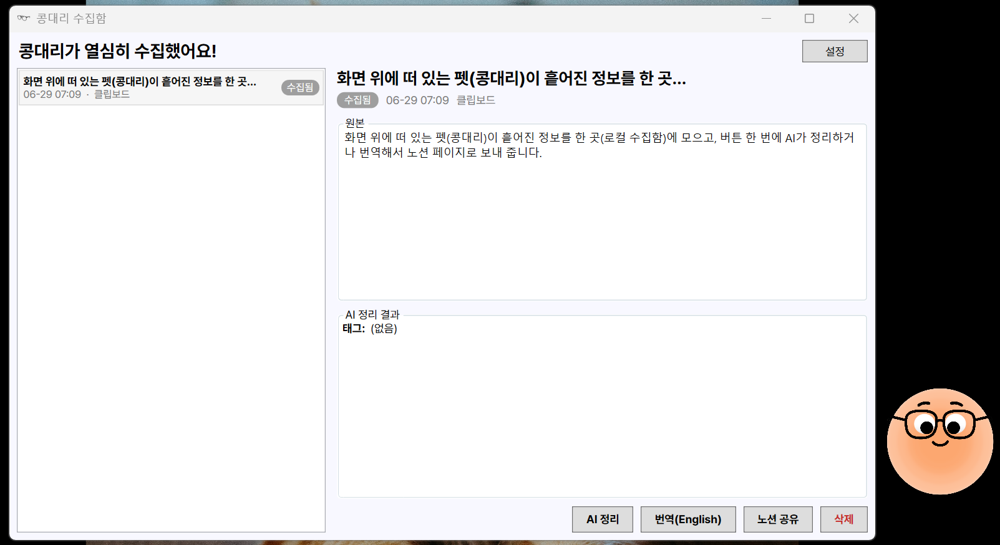
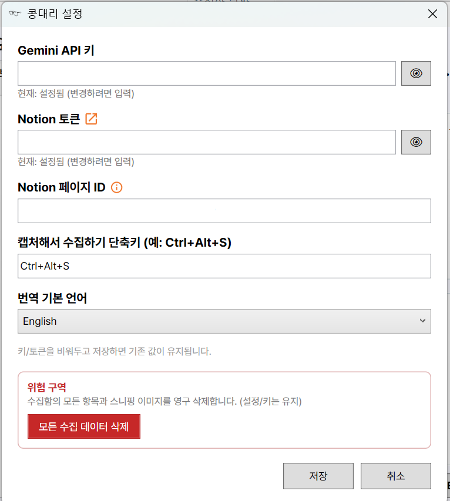

# 콩대리 (KongDaeri)

> 내 데스크톱 화면 위에 띄워지며 클립보드·화면에서 정보를 주워 담아, AI로 정리·번역해 노션에 아카이빙해 주는 **Windows 데스크톱 AI 비서 펫**.

화면 위에 떠 있는 펫(콩대리)이 흩어진 정보를 한 곳(로컬 수집함)에 모으고, 버튼 한 번에 AI가 정리하거나 번역해서 노션 페이지로 보내 줍니다.

## 핵심 기능

- **수집** — 클립보드 복사 감지(자동 저장) + 전역 단축키로 화면 영역 캡처(스니퍼). 두 입력이 하나의 파이프라인으로.
- **AI 처리(수동)** — 수집함에서 [AI 정리] 또는 [번역]을 누르면 Gemini가 노션용 마크다운으로 정리/번역. 화면 캡처는 비전 인식으로 텍스트·표 추출.
- **노션 전송** — [노션 공유] 한 번으로 정리/번역 결과를 노션 페이지로 생성.
- **민감정보 보호** — 저장 직전 필터로 고위험(카드·주민번호·API 키) 수집 차단, 중위험(비밀번호·이메일·전화) 마스킹. 수집 일시정지 토글.
- **데스펫 UX** — 투명 오버레이, 드래그 이동, 더블클릭=수집함, 우클릭=메뉴, 눈 깜빡임·표정(성공/실패) 반응.

## 스크린샷





(스크린샷 추가 예정)

## 빌드 / 실행

**요구사항**: Windows, .NET 10 SDK

```bash
dotnet run --project src/KongDaeri
```

또는 `KongDaeri.slnx` 를 Visual Studio로 열어 실행(F5).

## 설정

최초 실행 후, 펫 우클릭(또는 트레이) → **설정** 창에서 아래를 입력합니다.

- **Gemini API 키** — AI 정리/번역용
- **Notion 토큰** — Internal Integration Token
- **Notion 페이지 ID** — 정리 내용을 올릴 부모 페이지 (해당 페이지를 인티그레이션에 **Connect** 해야 함)
- (선택) 캡처 단축키(기본 `Ctrl+Alt+S`), 번역 기본 언어(기본 영어)

형식은 [`docs/settings.example.json`](docs/settings.example.json) 참고. 입력값은 `%LOCALAPPDATA%\KongDaeri\settings.json` 에 저장되며 **저장소에 커밋되지 않습니다.**

> ⚠️ **API 키·토큰을 README나 소스, 저장소 어디에도 넣지 마세요.** 키는 항상 로컬 `settings.json`(gitignore됨)에만 보관합니다.

## 기술 스택

C# / .NET 10 / WPF · CommunityToolkit.Mvvm · SQLite(Microsoft.Data.Sqlite) · Google Gemini(`gemini-2.5-flash-lite`, 멀티모달) · Notion REST API · Win32 P/Invoke(전역 단축키·클립보드·화면 캡처).

자세한 기획·아키텍처·구현 현황은 [`docs/KongDaeri_PLAN.md`](docs/KongDaeri_PLAN.md) 참고.
